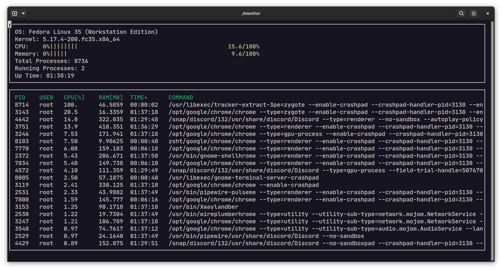

# SysMonitor

This is a humble attempt to build a system monitor. Linux stores a lot of system data in files within the /proc directory. Most of the data that this project displays exists in those files.

# Dependencies for Running Locally

`ncurses` is a library that facilitates text-based graphical output in the terminal. 
This project relies on ncurses for display output. Please check your distro package manager on installing the appropriate libraries.

* cmake >= 3.11.3
  * All OSes: [click here for installation instructions](https://cmake.org/install/)
* make >= 4.1 (Linux, Mac), 3.81 (Windows)
  * Linux: make is installed by default on most Linux distros
  * Mac: [install Xcode command line tools to get make](https://developer.apple.com/xcode/features/)
  * Windows: [Click here for installation instructions](http://gnuwin32.sourceforge.net/packages/make.htm)
* gcc/g++ >= 7.4.0
  * Linux: gcc / g++ is installed by default on most Linux distros
  * Mac: same instructions as make - [install Xcode command line tools](https://developer.apple.com/xcode/features/)
  * Windows: recommend using [MinGW](http://www.mingw.org/)

# Instructions

1. Clone the project repository: `git clone https://github.com/PedroGabrielBHZ/SysMonitor.git`
2. Build the project: `make build`
3. Run the resulting executable: `./build/monitor`
